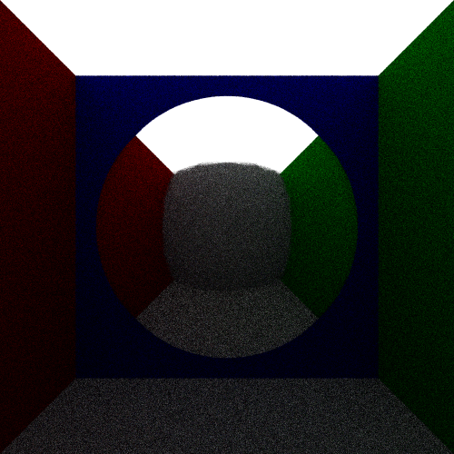

# Examples

Here are a number of examples to take insperation from, and to see how the
mechanics of constructing a scene works.

## Diffuse Sphere :id=diffusesphere

## Specular Sphere

This scene is a variant of the basic [Diffuse Sphere](#diffusesphere), with
the change that the sphere is now a perfect mirror surface.

```lua
l = Material.new(1.0, 1.0, 1.0):set_emission(1.0)
r = Material.new(1.0, 0.0, 0.0)
g = Material.new(0.0, 1.0, 0.0)
b = Material.new(0.0, 0.0, 1.0)
d = Material.new(1.0, 1.0, 1.0):set_type(Material.Type.DIFFUSE)
s = Material.new(1.0, 1.0, 1.0):set_type(Material.Type.SPECULAR)

Sphere.new(5.0):translate(0.0, 0.0, 0.0):set_material(s)
Plane.new(0.0, 1.0, 0.0, 0.0):rotate_z(math.pi):translate(0.0, 20.0, 0.0):set_material(l)
Plane.new(0.0, 1.0, 0.0, 0.0):rotate_z(0.0):translate(0.0, -20.0, 0.0):set_material(d)
Plane.new(0.0, 1.0, 0.0, 0.0):rotate_z(math.pi/2):translate(20.0, 0.0, 0.0):set_material(r)
Plane.new(0.0, 1.0, 0.0, 0.0):rotate_z(-math.pi/2):translate(-20.0, 0.0, 0.0):set_material(g)
Plane.new(0.0, 1.0, 0.0, 0.0):rotate_x(-math.pi/2):translate(0.0, 0.0, 20.0):set_material(b)
Plane.new(0.0, 1.0, 0.0, 0.0):rotate_x(math.pi/2):translate(0.0, 0.0, -20.0):set_material(d)

camera:center(0.0, 0.0, 0.0)
camera:eye(0.0, 0.0, -10.0)
```

This will produce the output shown below.


